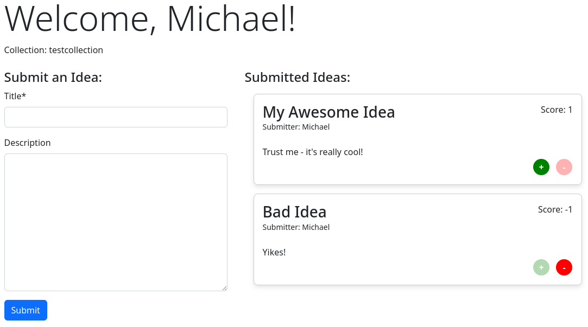

# IdeaHub

IdeaHub is a Django app for collecting ideas and voting on them.

## Motivation

My friends and I were planning a trip to london and keeping track of all the
suggestions in our group chat seemed horrifying to me.

So I wrote this app where you can submit `Ideas` to a `Collection` and
vote on them to get a ranking.

## Preview

